# Systematic Review Datasets

This repository provides an overview of labeled datasets used for Systematic Reviews. The
datasets are available under an open licence and can be used for text mining and machine
learning purposes. This repository contains scripts to collect, preprocess and clean
the systematic review datasets.

## Datasets

The datasets are alphabetically ordered. See [index.csv](index.csv) for all available properties.

<!-- DO NOT EDIT TABLE BELOW, EDIT METADATA INSTEAD -->

<!-- BEGIN TABLE -->

### Appenzeller-Herzog_2020

- License: CC-BY Attribution 4.0 International

### Bannach-Brown_2019

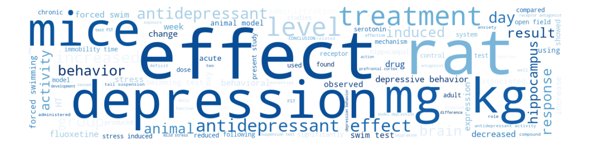

- License: CC-BY Attribution 4.0 International

### Bos_2018

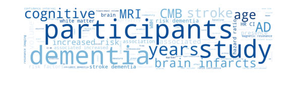

- License: CC-BY Attribution 4.0 International

### Cohen_2006_ACEInhibitors

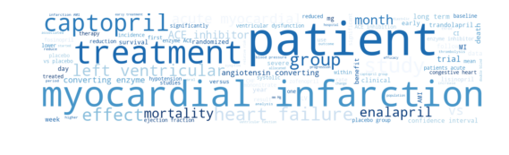

- License: custom open license

### Cohen_2006_ADHD

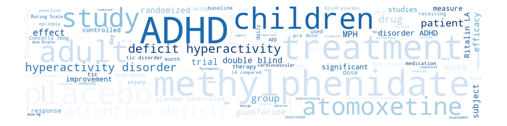

- License: custom open license

### Cohen_2006_Antihistamines

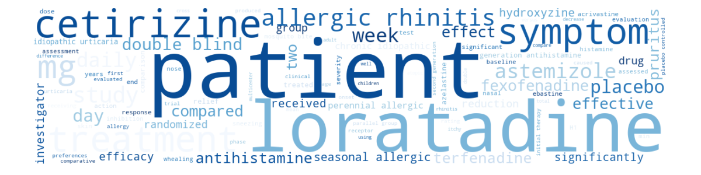

- License: custom open license

### Cohen_2006_AtypicalAntipsychotics

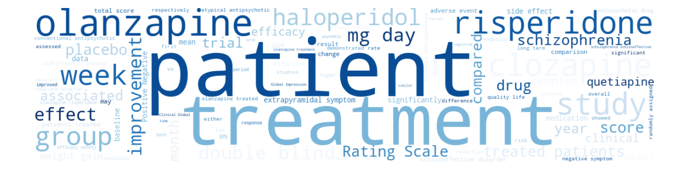

- License: custom open license

### Cohen_2006_BetaBlockers

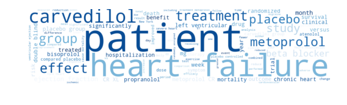

- License: custom open license

### Cohen_2006_CalciumChannelBlockers

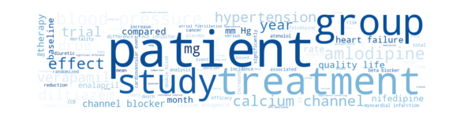

- License: custom open license

### Cohen_2006_Estrogens

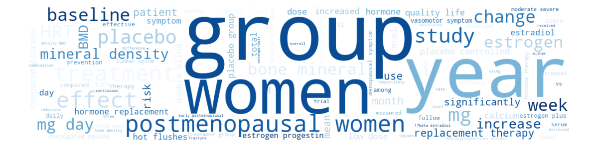

- License: custom open license

### Cohen_2006_NSAIDS

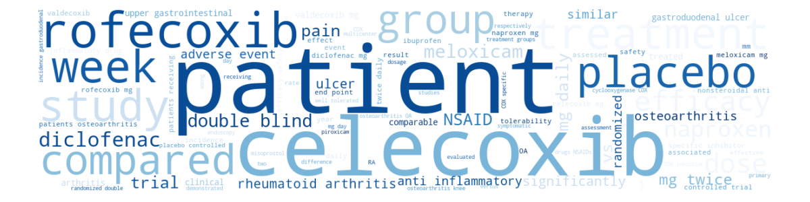

- License: custom open license

### Cohen_2006_Opiods

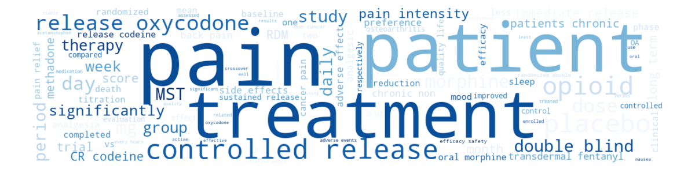

- License: custom open license

### Cohen_2006_OralHypoglycemics

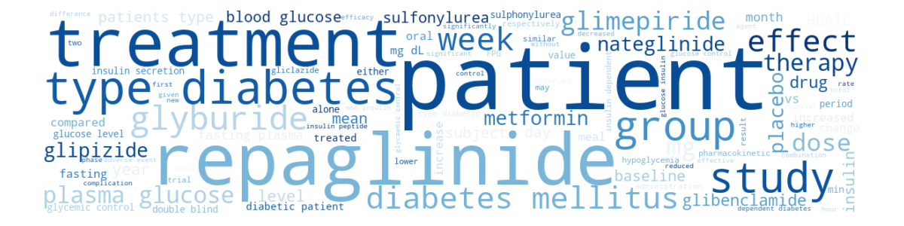

- License: custom open license

### Cohen_2006_ProtonPumpInhibitors

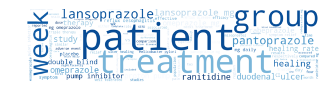

- License: custom open license

### Cohen_2006_SkeletalMuscleRelaxants

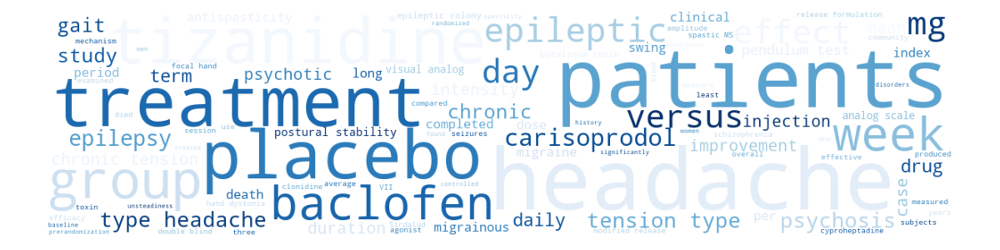

- License: custom open license

### Cohen_2006_Statins

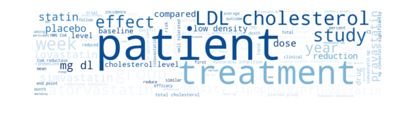

- License: custom open license

### Cohen_2006_Triptans

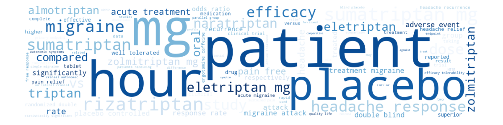

- License: custom open license

### Cohen_2006_UrinaryIncontinence

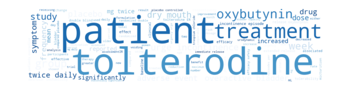

- License: custom open license

### Hall_2012

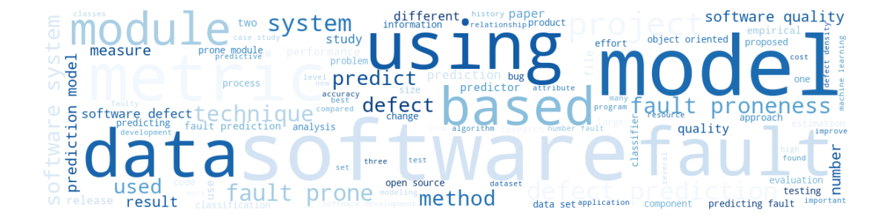

- License: CC-BY Attribution 4.0 International

### Kitchenham_2010

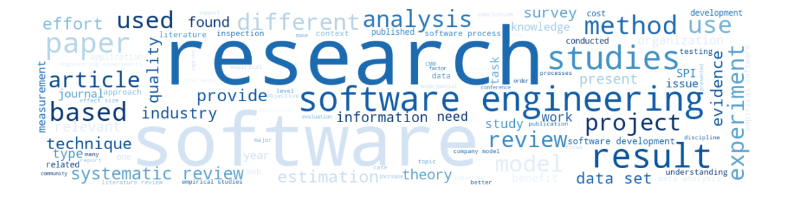

- License: CC-BY Attribution 4.0 International

### Kwok_2020

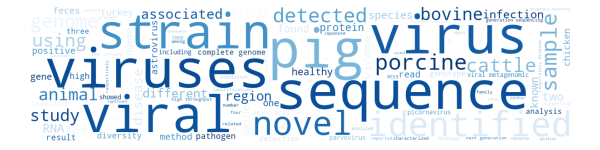

- License: CC-BY Attribution 4.0 International

### Nagtegaal_2019

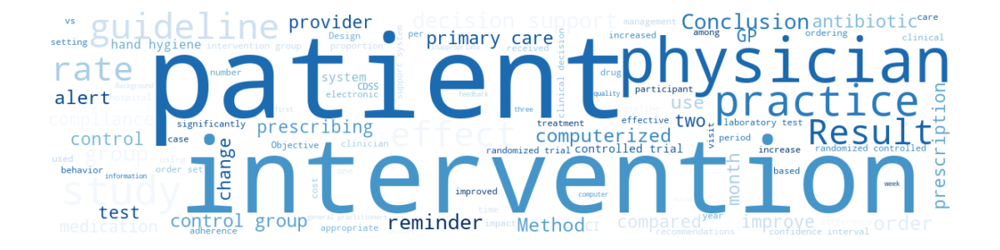

- License: CC0

### Radjenovic_2013

- License: CC-BY Attribution 4.0 International

### Wahono_2015

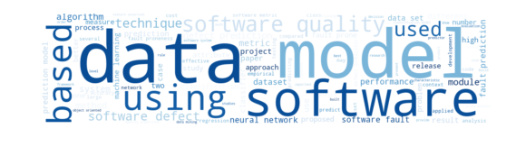

- License: CC-BY Attribution 4.0 International

### Wolters_2018

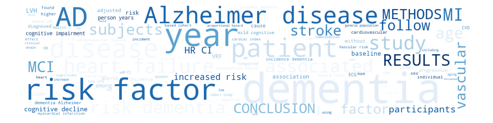

- License: CC-BY Attribution 4.0 International

### van_Dis_2020

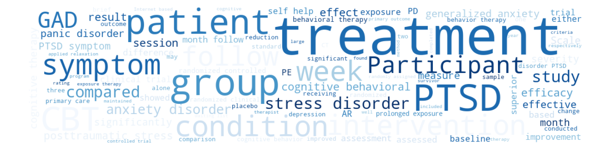

- License: CC-BY Attribution 4.0 International

### van_de_Schoot_2017

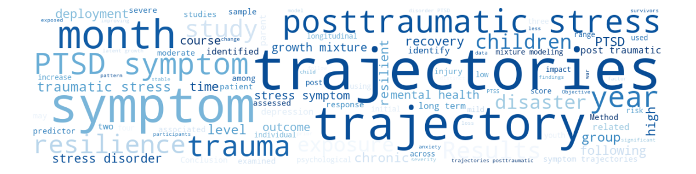

- License: CC-BY Attribution 4.0 International

<!-- END TABLE -->

## Publishing your data
For publishing either your data and / or your AI-aided systematic review, we recommend using the Open Science frame (OSF). OSF is part of the Center for Open Science (COS), which aims at increasing openness, integrity, and reproducibility of research ([OSF](https://www.cos.io/our-products/osf), 2020). How to share your data using OSF: A [step-by-step guide](https://journals.sagepub.com/doi/pdf/10.1177/2515245918757689).

Another platform to publish your data open access is provided by Zenodo. Zenodo is a platform which encourages scientists to share all materials (including data) that are necessary to understand the scholarly process ([Zenodo](https://about.zenodo.org/), 2020).

When uploading your dataset to OSF or Zenodo, make sure to provide all relevant information about the dataset, by filling out all available fields. The data to be put on Zenodo or OSF can be documented as extensively as you would like (flowcharts, explanation of certain decisions, etc.). This can include a link to the systematic review itself, if it has been published elsewhere.

### License

When sharing your dataset or a link to your already published systematic review, we recommend using a CC-BY or CC0 license for both Zenodo and OSF. By adding a Creative Commons license, everybody from individual creators to large institutions are given a standardized way to allow use of their creative work under copyright law ([Creative Commons](https://creativecommons.org/about/cclicenses/), 2020).

In short, the CC-BY license means that reusers are allowed to distribute, remix, adapt, and build upon the material in any medium or format, so long as attribution is given to the creator. The license allows for commercial use. The CC0 license releases data in the public domain, allowing reuse in any form without any conditions. This can be appropriate when sharing (meta)data only. With both OSF (see step-by-step guide) and Zenodo you can easily add the license to your project after creating a project in either platform.

### Collecting and preprocessing data

The folder `datasets/` has subfolders for the different systematic reviews
datasets. In each of these subfolders, the `.ipynb` script retrieve a dataset from OSF or Zenodo, and preprocesses it by adding customized labels and marking duplicates. The script also reports the inclusion rate, and missing patterns and word clouds of titles and abstracts. After preprocessing, an ASReview-ready dataset in `.csv` format is generated in the `output/` folder.

### Format of data
After reviewing in ASReview LAB, you can export your data, which will provide a file that is in the correct format to be uploaded to the repository.
ASReview LAB accepts the file formats mentioned in the table below. More information on the format of the data to be put into ASReview LAB can be found in the [datasets](https://asreview.readthedocs.io/en/latest/intro/datasets.html) documentation.

### Format of data without ASReview LAB
If you would like to share your data without having used ASReview LAB for the screening of your records, or because you have done the screening manually, please make sure the datafile is in the right format. Two examples can be found at the bottom of the page.

Extensions .csv, .xlsx, and .xls. CSV files should be comma separated and UTF-8 encoded. For CSV files, the simulation software accepts a set of predetermined labels in line with the ones used in RIS files:  "title" and "abstract". To indicate labelling decisions, one can use "included" or "label\_included".
The latter label called "included" is needed to indicate the final included publications in the simulations. This label should be filled with all 0’s and 1’s, where 0 means that the record is not included and 1 means included.

### Examples
Two examples of authors who have published their systematic review data online:
- A systematic review on treatment for Wilson disease, in RIS format https://zenodo.org/record/3625931#.XvB\_92ozblw
- Data from four systematic reviews on fault prediction in software engineering, in .csv format https://zenodo.org/record/1162952#.XvCCZmozblw.

## Special thanks

Open data on systematic reviews is important to advance research on machine learning enhanced systematic reviews. We thank the following people for publising their datasets openly.

<!-- DO NOT EDIT AUTHORS BELOW, EDIT METADATA INSTEAD -->

<!-- BEGIN AUTHORS -->

Ananiadou, S., Appenzeller-Herzog , C., Bannach-Brown, A., Beecham, S., Bekkers, V., Bos, D., Bowes, D., Budgen, D., Cohen, A. M., Counsell, S., Darweesh, S. K. L., Depaoli, S., Ewald H., Gray, D., Hagenaars, M. A., Hall, T., Heeres, M. L. S., Heričko, M., Hersh, W. R., Hofman, A., Houwen, R. H. J., Ikram, M. A., Kitchenham, B., Koopmans, M. P. G., Kwok, K. T. T., Liao, J., Linkman, S., Macleod, M. R., Mathes, T., Nagtegaal, R., Niazi, M., Nieuwenhuijse, D. F., Noordegraaf, M., Olff, M., Pearl Brereton, O., Peterson, K., Phan, M. V. T., Pretorius, R., Przybyla, P., Radjenović, D., Rice, A. S. C., Sabayan, B., Sedaghat, S., Segufa, R. A., Sijbrandij, M., Thomas, J., Torkar, R., Tummers, L., Turner, M., Vernooij, M. W., Wahono, R. S., Weiss, K. H., Winter, S. D., Wolters, F. J., Yen, P., de Wolf, F., et al., van Dis, E. A. M., van Loey, N. E., van Veen, S. C., van de Schoot, R., Živkovič, A.

<!-- END AUTHORS -->

## Contact

Contact details can be found at the [ASReview](https://github.com/asreview/asreview#contact)
project page.

